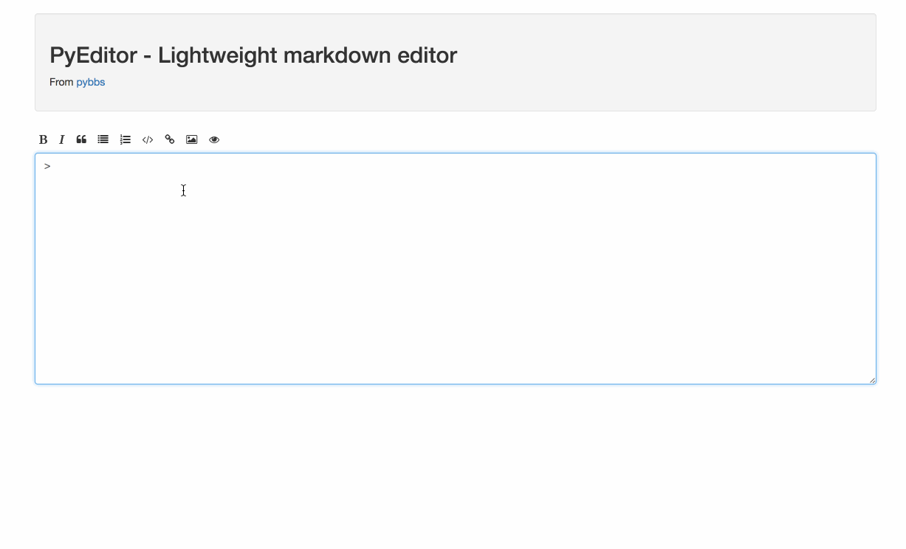

## PyEditor

## Introduce

PyEditor - LightWeight Markdown Editor

From [pybbs](https://github.com/atjiu/pybbs)

## Preview

## Usage

If you're using Bootstrap, then copy the code from the example directly

## Run Example

- Install NodeJS in your computer
- Then run `cd example && npm install && node app.js`
- Last, Open browser && visit: http://127.0.0.1:3000

## Contribution

Any comments or suggestions are welcome to mention issue, and also welcome Pull Request

## License

MIT
